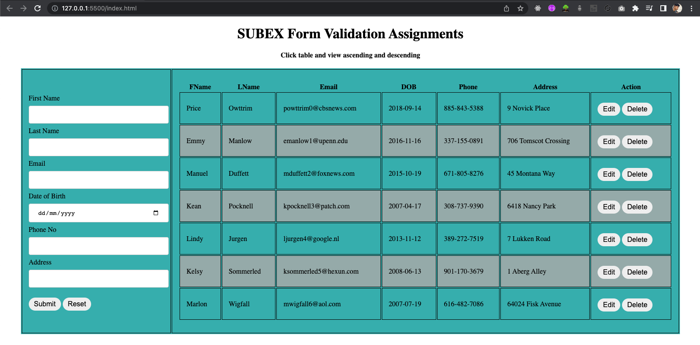
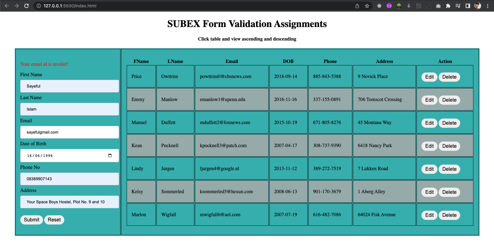
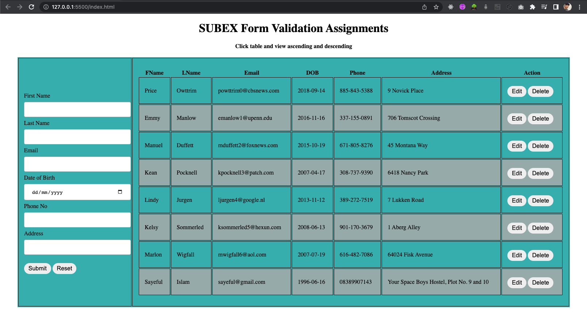
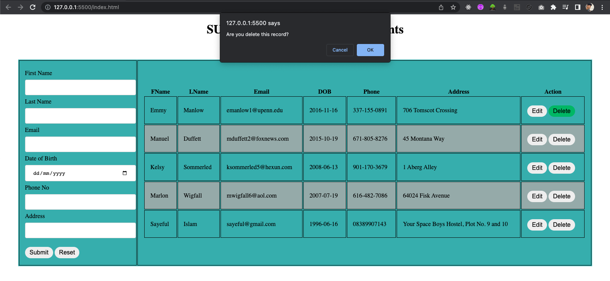
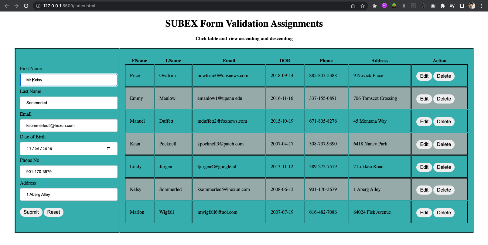
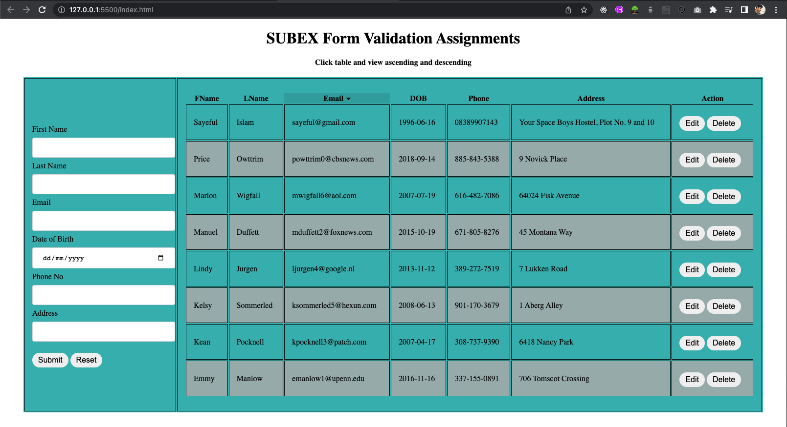

## Run this project
click this link = https://sayef367.github.io/Subex/

## Run Local file

### `index.html`

## Main Home Page

## Form validation 

## New Data add the table

## Delete few data

## Update data

## ascending and descending
